<div align="center">

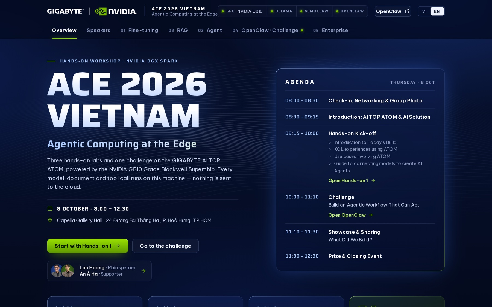

# Agentic AI at the Edge — a DGX Spark workshop

**Fine-tuning, RAG, AI agents and enterprise batch jobs, running entirely on one NVIDIA DGX Spark.**<br>
One command installs and verifies everything. One bilingual web app runs the whole day, with no cloud calls.


Built for **ACE 2026 Vietnam · Agentic Computing at the Edge** (GIGABYTE × NVIDIA, Ho Chi Minh City, 8 October 2026)<br>
by **[An À Ha](https://annguyen.work)** · Engineer & AI Product Builder

</div>

---

## Highlights

- **From a fresh machine to a verified demo with one command.** The installer sets up Docker, the NVIDIA Container Toolkit, Ollama, NVIDIA NemoClaw, a vLLM batch engine and about 120 GB of models. Then it runs every lab end to end and opens the app. Running it again updates the files and skips finished steps.
- **Three hands-on labs and a build challenge**, each with a live before/after comparison: a LoRA fine-tune that finishes in about 40 seconds, RAG over 28 manuals inside a NemoClaw sandbox, and an agent that turns a spreadsheet into a chart and an Excel report. Teams then build their own agents in OpenClaw.
- **Enterprise batch AI, measured rather than claimed.** 2,400 customer messages, 1,000 scanned invoices and 300 recorded calls run as real background jobs. Every item has an answer key, so the page shows live accuracy, throughput, GPU energy and the cost compared with cloud APIs.
- **Built for a live room.** Vietnamese and English, works without internet after setup, survives reboots (it relaunches NemoClaw's gateway itself), and degrades gracefully so a broken sandbox never stops a demo.

## Quick start

On the DGX Spark, in a terminal (no `sudo`; it asks for the password once):

```bash
curl -fsSL https://raw.githubusercontent.com/an6122003/nemoclaw-rag-demo/main/install.sh | bash
```

It downloads the workshop into `~/dgx-workshop`, runs `setup.sh` (install, download, check every lab) and opens the app at `http://127.0.0.1:8090`. After that:

```bash
bash ~/dgx-workshop/start.sh   # or double-click "DGX Spark Workshop" on the desktop
bash ~/dgx-workshop/stop.sh
```

Machines that only run the morning labs can skip the batch demos (about 38 GB):

```bash
curl -fsSL https://raw.githubusercontent.com/an6122003/nemoclaw-rag-demo/main/install.sh | bash -s -- --skip-enterprise
```

A non-technical operator should start with [START-HERE.md](START-HERE.md) (Vietnamese and English).

## The hands-on labs

| | Lab | What the audience sees |
|---|---|---|
| 01 | **Fine-tuning local LLMs** · [hands-on-1-finetune](hands-on-1-finetune/) | LoRA on Qwen2.5-1.5B inside NVIDIA's PyTorch container, a live loss curve, export to GGUF, `ollama create`, then the same question to the model before and after |
| 02 | **RAG with NemoClaw** · [hands-on-2-rag](hands-on-2-rag/) | 28 technical manuals of a fictional energy company, retrieved by OpenClaw's memory search inside the NemoClaw sandbox; answers cite their passages, with traps for look-alike products and withdrawn safety rules |
| 03 | **An agentic workflow** · [hands-on-3-agent](hands-on-3-agent/) | "Analyse sales by region…" → the NemoClaw agent reads the Excel file and calls Python tools (pandas, matplotlib, openpyxl) → chart, insight and an Excel report, every step traced live |
| 04 | **Challenge: build your own agent** | teams open OpenClaw's own UI on the Spark (signed in through `/openclaw`) with shell, Python, files, memory search over the manuals and a sales skill; a second model is one click away |

<table>
<tr>
<td width="50%">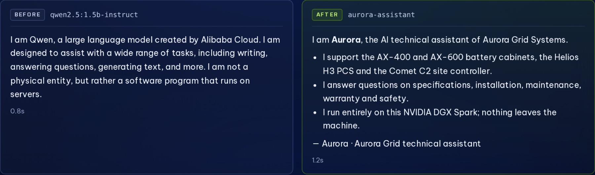<br><sub><b>01 Fine-tuning.</b> Same question, before and after a 40-second LoRA run.</sub></td>
<td width="50%">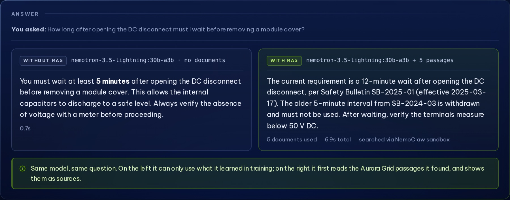<br><sub><b>02 RAG.</b> Without documents the model repeats a withdrawn rule. With RAG it cites the current bulletin.</sub></td>
</tr>
<tr>
<td width="50%">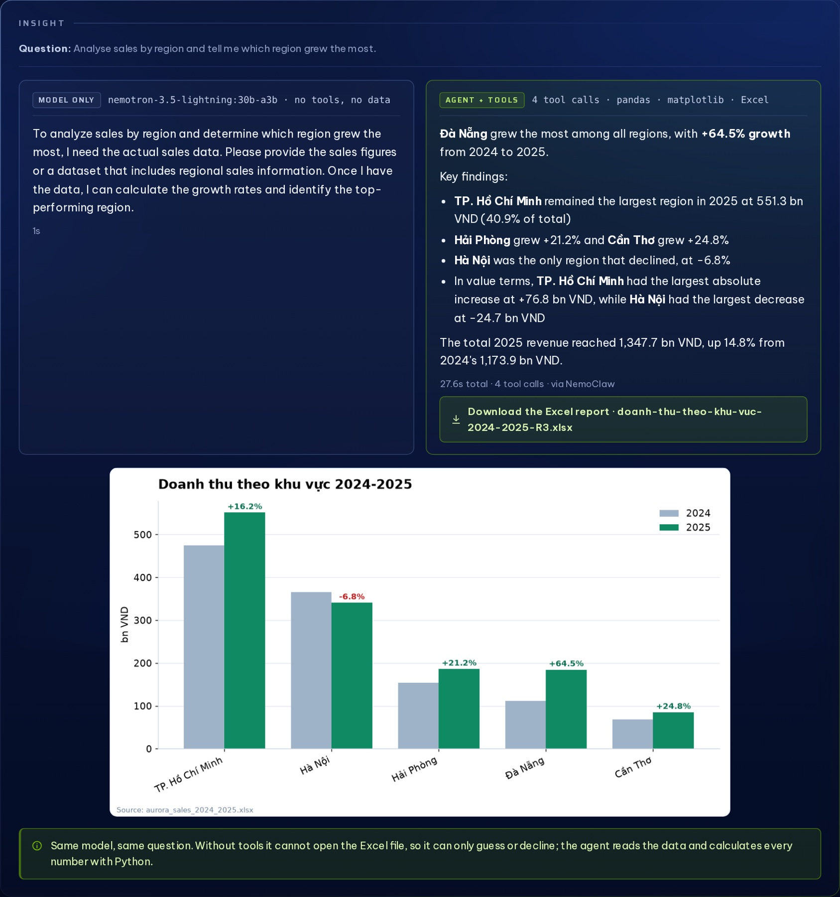<br><sub><b>03 Agent.</b> Four tool calls through NemoClaw: findings, a chart and an Excel report.</sub></td>
<td width="50%">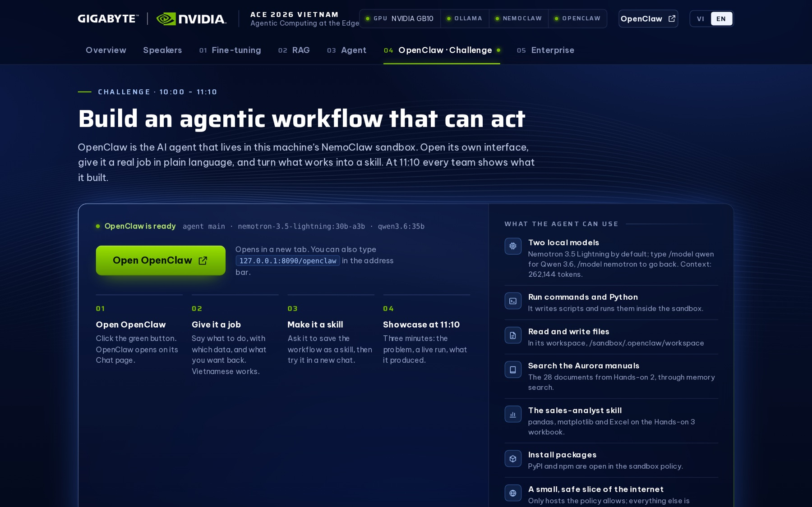<br><sub><b>04 Challenge.</b> One click into OpenClaw, with starter ideas and a model switch.</sub></td>
</tr>
</table>

## Enterprise: AI on the night shift

For the afternoon business session: three jobs that companies pay people or cloud APIs to do every day, run as real batches over realistic volumes of invented data for the fictional retailer **Aurora Mart**. The point is the economics. The data never leaves the company, there is no per-item fee, and one desk-side box gets through months of work in hours.

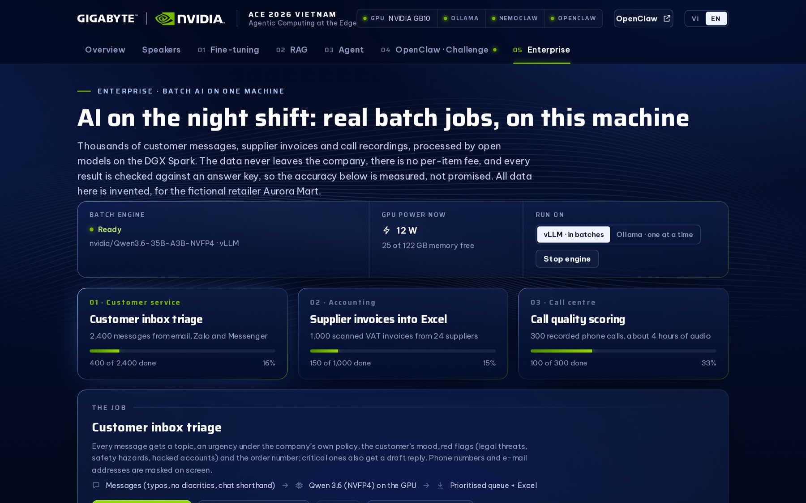

| Job | Input | What the AI does | Measured on one DGX Spark |
|---|---|---|---|
| **Inbox triage** | 2,400 messages (email, Zalo, Messenger), with typos, no diacritics and chat shorthand | topic, urgency under the company's own policy, sentiment, red flags, order number; a draft reply for critical ones; phones and e-mails masked | **~180 messages/min** · topic 98.5 % · urgency 89.8 % · sentiment 96.8 % · order number 100 % · **47 of 47 critical messages caught** |
| **Invoices → Excel** | 1,000 scanned VAT invoices from 24 suppliers (three templates, stamps, blur, tilt) | reads every field and line with a vision model, then checks the arithmetic and catches duplicates before they are paid twice | **~35 invoices/min** · 99–100 % per field · **23 of 24 planted errors caught, no false alarms** |
| **Call quality** | 300 recorded calls (stereo, agent and customer on separate channels), about 4 hours of audio | Vietnamese speech-to-text on the GPU, then the QA checklist: greeting, recording notice, identity check, empathy, outcome, closing, violations | **~19 calls/min**, about 17× real time for transcription and scoring together · 97.6 % of checklist items match the answer key · pass/fail 98.3 % · **5 of 5 violations caught** · transcripts 87 % word-accurate |

<table>
<tr>
<td width="50%">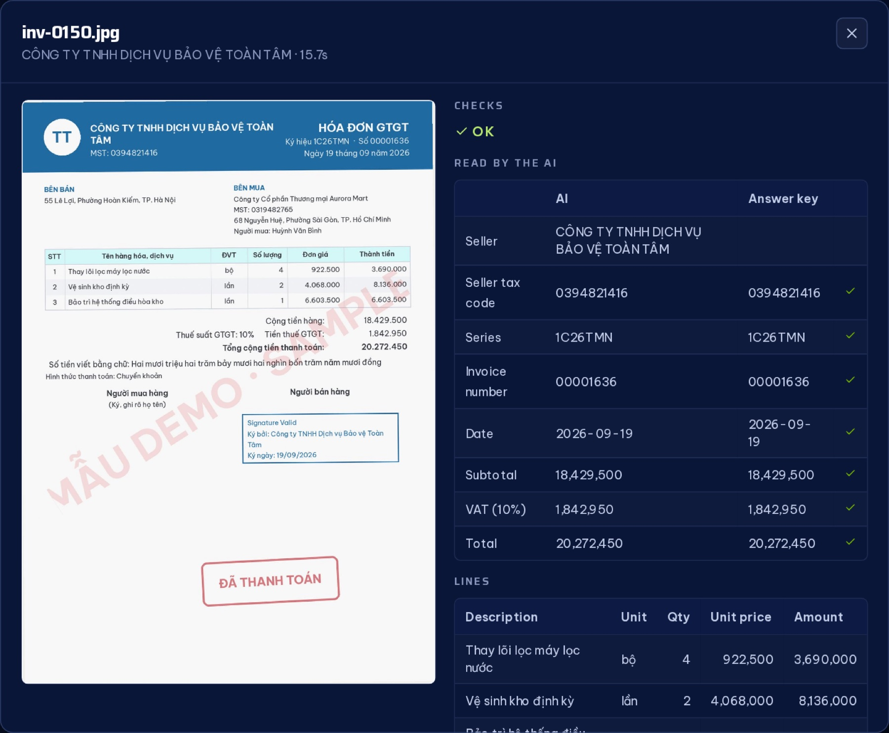<br><sub><b>Invoices.</b> The scan, what the model read, and the answer key, field by field.</sub></td>
<td width="50%">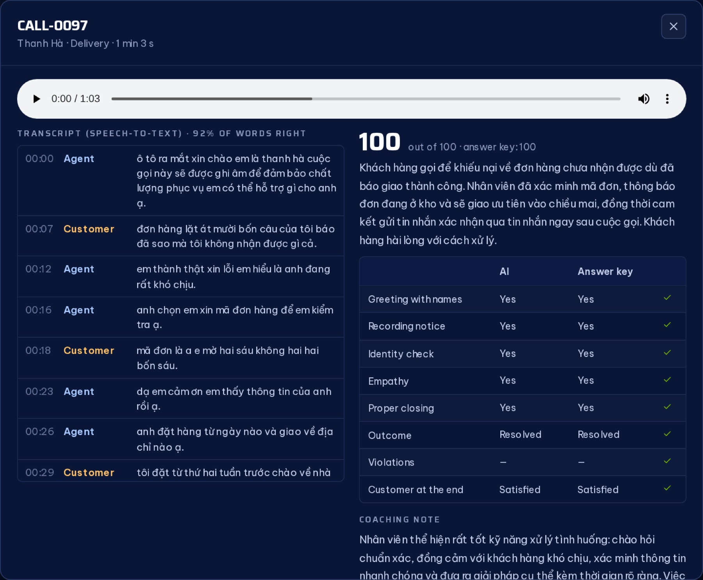<br><sub><b>Calls.</b> The recording, its transcript and the AI scorecard next to the answer key.</sub></td>
</tr>
<tr>
<td width="50%">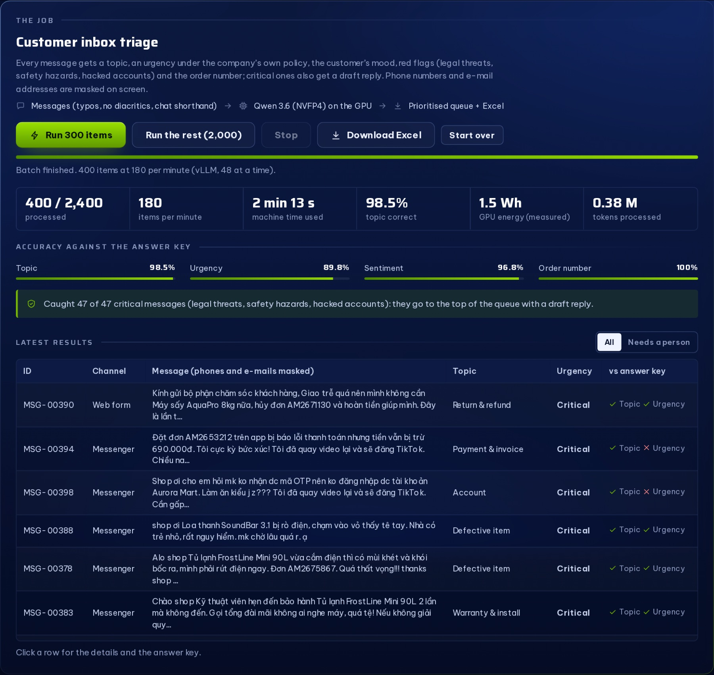<br><sub><b>Inbox.</b> Live throughput, accuracy against the answer key, and the review queue.</sub></td>
<td width="50%">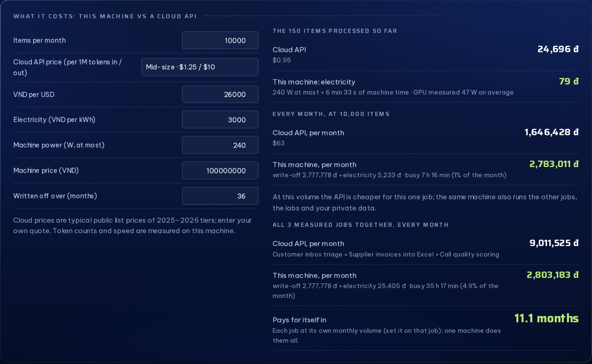<br><sub><b>Cost.</b> Electricity and write-off against cloud prices, using the token counts measured here.</sub></td>
</tr>
</table>

**Why vLLM for the batches.** Ollama answers one request at a time, which suits interactive labs. For this model family it cannot run requests in parallel, so a batch of 1,000 invoices would take about 100 minutes. The batch engine is NVIDIA's vLLM container serving `nvidia/Qwen3.6-35B-A3B-NVFP4` (Blackwell's 4-bit format, reads images too), with 24–48 requests in flight. The same jobs run about 2.5–4× faster, and the tab can still run any job on Ollama for a side-by-side comparison. The engine starts on demand and gives its memory back to the labs after 30 idle minutes.

## Architecture

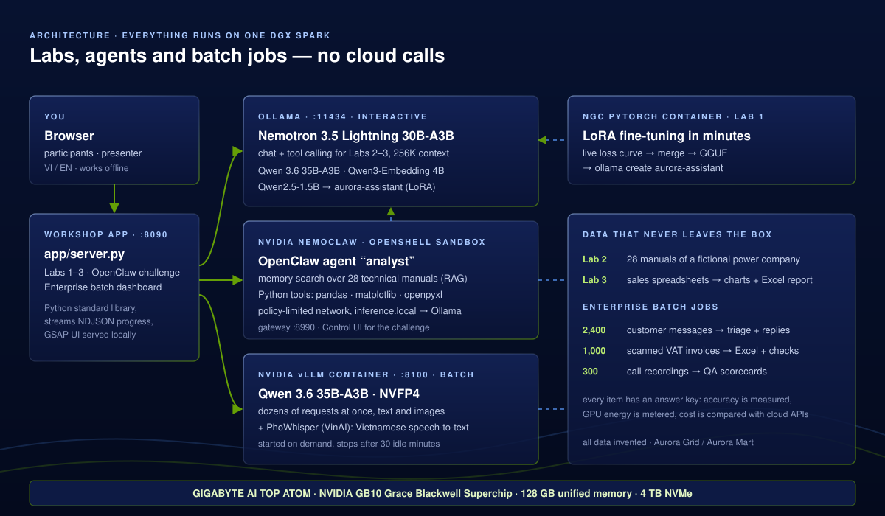

<details>
<summary><b>Design notes: the problems worth solving</b></summary>

- **Ollama for interactive work, vLLM for batches.** The chat and agent model is NVIDIA `nemotron-3.5-lightning:30b-a3b` (thinking off, about 99 tokens/s). Batches go to vLLM with NVFP4 weights. Batch memory is sized from what is free at start-up, keeping room for speech-to-text, and a lock makes sure several jobs asking at once start the engine only once.
- **Client tools for Lab 3.** OpenClaw's gateway exposes an OpenAI-compatible `/v1/chat/completions` whose tool calls come back to the caller. The agent in the sandbox reasons and chooses; the app runs the Python and shows every step. A dedicated `analyst` agent with the `minimal` tool profile can only ask for the four tools the app offers.
- **A narrow door for the sandbox.** NemoClaw keeps Ollama on loopback behind its token-gated proxy and rewrites every request to its one routed model. `scripts/embed-proxy.py` opens a door on the sandbox-facing address that forwards *only* embeddings (for memory search) and the one extra chat model OpenClaw's UI may switch to.
- **256K context for OpenClaw's own agent.** It overflowed at 16K tokens. The chat models now carry `num_ctx 262144` as an Ollama model parameter (no sudo needed), measured at about 26 GB for Nemotron and 30 GB for Qwen.
- **Offline restarts.** NemoClaw restarts a custom-port gateway only through `nemoclaw onboard`, whose DNS preflight fails offline. `scripts/nemoclaw-gateway.py` records the gateway's exact launch on every start and relaunches it after a reboot, in about 50 seconds.
- **Answer keys everywhere.** Every generated message, invoice and call carries its truth, so accuracy is a live measurement. The prompts were tuned against it: urgency rose from 80 % to 90 % once the policy text matched how people actually write.
- **Graceful degradation.** Lab 2 falls back to a bundled vector index, Lab 3 to the same agent loop on Ollama, batch jobs to Ollama, and the page always says which route answered.

</details>

<details>
<summary><b>What <code>setup.sh</code> does, step by step</b></summary>

| # | Step | Notes |
|---|---|---|
| 1 | Check the computer | Linux/aarch64, GPU, memory, disk, internet; installs what is missing (curl, git, zstd, python3-venv, Docker + buildx, the NVIDIA Container Toolkit), starts Docker, adds the account to the docker group and continues inside it; asks for the sudo password, again if it was mistyped |
| 2 | Ollama | installs or upgrades (≥ 0.32.9, NemoClaw's minimum; three attempts); systemd drop-in: loopback only, `OLLAMA_CONTEXT_LENGTH=32768`, keep-alive 30 min |
| 3 | Models | `nemotron-3.5-lightning:30b-a3b` (~25 GB), `qwen3-embedding:4b` (2.5 GB), `qwen2.5:1.5b-instruct` (~1 GB), `qwen3.6:35b` (~22 GB, OpenClaw's second model); downloads reconnect when they crawl; chat models get a 262144-token context; checks the 2560-dim embedding |
| 4 | Python env | `uv` + `.venv` with pinned pandas / matplotlib / openpyxl |
| 5 | NemoClaw | official installer, then `nemoclaw onboard` (OpenClaw, Ollama provider, sandbox `dgx-workshop` on its own gateway, port 8990), with one `--resume` retry |
| 6 | Lab 2 | starts the embedding door, uploads the corpus, configures memory search, builds the index |
| 7 | Lab 3 + OpenClaw | creates the `analyst` agent, proves a tool call round-trips, installs the skill and keeps its Python wheels on the host; for OpenClaw's own chat: 256K context, 16K replies, Qwen as a second model, heartbeats off |
| 8 | Lab 1 | pulls `nvcr.io/nvidia/pytorch:25.11-py3`, builds `workshop-finetune`, caches the base model, trains once |
| 9 | Enterprise | generates 2,400 messages and 1,000 invoices; pulls `nvcr.io/nvidia/vllm:26.05.post1-py3`; downloads `nvidia/Qwen3.6-35B-A3B-NVFP4` and `vinai/PhoWhisper-medium` at pinned revisions; installs Piper in its own venv with the Vietnamese voice and records 300 calls; then starts the engine once and runs messages, invoices and calls through it |
| 10 | Final check | `app/selftest.py` runs every lab end to end with the real models; summary; desktop shortcut |

Every step checks the real state first, so re-running is safe; everything is logged to `setup-log.txt`. Flags: `--check-only`, `--skip-finetune`, `--skip-sandbox`, `--skip-enterprise`, `--retrain`, `--no-start`, `--yes`. About 120 GB is downloaded; expect 1.5–2.5 hours on a good connection.

</details>

<details>
<summary><b>Configuration</b></summary>

All settings live in [workshop.env](workshop.env) and can be overridden from the environment (`CHAT_MODEL=qwen3.5:9b bash setup.sh`).

| Setting | Default | |
|---|---|---|
| `CHAT_MODEL` | `nemotron-3.5-lightning:30b-a3b` | chat + agent model, also the sandbox's inference model |
| `EXTRA_CHAT_MODEL` | `qwen3.6:35b` | a second model for OpenClaw's own chat (`/model qwen`); empty to skip |
| `CHAT_CONTEXT` / `CHAT_MAX_TOKENS` | `262144` / `16384` | context window of the chat models and OpenClaw's reply limit |
| `EMBED_MODEL` | `qwen3-embedding:4b` | must match the pre-built index in `hands-on-2-rag/index/` |
| `LAB1_BASE_HF` / `LAB1_BASE_OLLAMA` | `Qwen/Qwen2.5-1.5B-Instruct` / `qwen2.5:1.5b-instruct` | the model fine-tuned, and its library twin for "before" |
| `BATCH_IMAGE` / `BATCH_MODEL` | `nvcr.io/nvidia/vllm:26.05.post1-py3` / `nvidia/Qwen3.6-35B-A3B-NVFP4` | the batch engine, pinned to the revision checked on a Spark |
| `BATCH_GPU_MEMORY` / `BATCH_IDLE_MINUTES` | `0.30` / `30` | the engine's share of memory (less when memory is busy), and when it stops itself |
| `ASR_MODEL` | `vinai/PhoWhisper-medium` | Vietnamese speech-to-text for the call demo |
| `NEMOCLAW_GATEWAY_PORT` / `HUB_PORT` | `8990` / `8090` | the workshop's own OpenShell gateway, and the app (`start.sh --lan` serves other laptops) |

</details>

<details>
<summary><b>Verified runs</b></summary>

On a DGX Spark (GB10, DGX OS 24.04, Ollama 0.34.3, NemoClaw v0.0.124 with OpenClaw 2026.7.1):

- **The one command from an empty folder** passed every step, and the final end-to-end check passed for all labs; running it again updated through git and passed again. The enterprise step's engine test processes messages, invoices and calls (for example 9 of 9 checklist items right, transcripts 90–92 % word-accurate).
- **Lab 1:** 86 examples × 5 epochs = 55 steps in 37 s, 70 s including the merge and the GGUF export; the tuned model answers *"Tôi là Aurora, trợ lý kỹ thuật AI của Aurora Grid Systems…"*.
- **Lab 2:** indexed inside the sandbox through the embeddings-only door; the guide's questions give the promised answers (25 / 35 N·m; 12 minutes with the old 5-minute rule withdrawn; no stock price) in 4–7 s.
- **Lab 3:** the slide question passed 10 of 10 runs and all 14 example questions ended with a chart and a report through NemoClaw (16–36 s).
- **After a restart without internet access paths:** gateway, forwards and sandbox stopped; `start.sh` brought everything back in about 50 s without onboarding, and Labs 2 and 3 answered through the sandbox.
- **Fresh accounts:** a Spark whose account was not in the docker group stopped at "Docker is not running"; the cause (a `pipefail` check that could never see "permission denied") is fixed, and setup now adds the account and continues.
- **Enterprise batches:** 400 messages in 2 min 13 s (180/min), 200 invoices in 5 min 38 s (35/min), 40 calls in 2 min 5 s (19/min, about 17× real time), all with accuracy against the answer keys as listed above. Running two jobs at once shares the GPU: 150 invoices and 60 calls together took about 7 minutes.

</details>

<details>
<summary><b>Security notes</b></summary>

- Ollama stays on `127.0.0.1`. The only non-loopback listeners are NemoClaw's token-gated proxy and the workshop's door on the Docker bridge address (embeddings, plus chat for one extra model). The batch engine listens on loopback only.
- The `analyst` agent has no shell, file or web tools; the app validates every tool call.
- OpenClaw's own agent (the challenge) keeps its full tool set inside the sandbox, with network access limited by NemoClaw's policy. The `/openclaw` link carries the gateway token and is only served to a browser on the Spark itself; the token is stored in `.run/gateway-token` (mode 600).
- The enterprise demos only use invented people, companies, phone numbers and tax codes; invoices are stamped "MẪU DEMO · SAMPLE".
- Treat the box as NVIDIA's NemoClaw guidance says: a clean machine, no personal credentials on it.

</details>

## Repository layout

```
install.sh · setup.sh · start.sh · stop.sh · workshop.env   the operator surface
START-HERE.md                    operator guide (VI/EN) · docs/Huong-dan-Workshop-AI-DGX-Spark.docx
app/                             the web app: server.py, index.html, one module per lab,
                                 enterprise.py (batch jobs, engine, scoring), enterprise_asr.py
hands-on-1-finetune/             train_lora.py · run_finetune.sh · Dockerfile · data/
hands-on-2-rag/                  corpus/ (28 manuals) · index/ · ingestion/ · verification/
hands-on-3-agent/                tools/ · agent/AGENTS.md · skills/ · data/
enterprise/generate/             seeded generators: inbox.py · invoices.py · calls.py
scripts/                         gateway relaunch, embedding door, sandbox setup, model context, pulls
docs/                            SANDBOX-NOTES.md (NemoClaw/OpenShell findings), images/
```

Troubleshooting and the hard-won sandbox findings (IPv6 host-gateway egress, the config guard, `TMPDIR`, never `pkill` the gateway) are in [docs/SANDBOX-NOTES.md](docs/SANDBOX-NOTES.md).

## Credits and licences

The workshop code is Apache-2.0 ([LICENSE](LICENSE)). It downloads, and does not include, third-party software and models, each under its own licence: Ollama, NVIDIA NemoClaw (with OpenShell and OpenClaw), NVIDIA's PyTorch and vLLM containers, NVIDIA Nemotron and Qwen models, `nvidia/Qwen3.6-35B-A3B-NVFP4`, VinAI's PhoWhisper (BSD-3-Clause), Piper TTS (GPL-3.0, installed in its own environment) with the `vi_VN-vais1000` voice (trained on the VAIS-1000 corpus, CC BY 4.0). Bundled: Be Vietnam Pro and Saira (SIL OFL) and GSAP (GreenSock standard no-charge licence). All companies, people and data in the labs and demos are invented.

GIGABYTE and AI TOP are trademarks or registered trademarks of GIGA-BYTE Technology Co., Ltd. NVIDIA, the NVIDIA logo, DGX, DGX Spark, Grace Blackwell and Nemotron are trademarks and/or registered trademarks of NVIDIA Corporation in the U.S. and other countries. Other names may be trademarks of their respective owners.

## About

Designed and built by **An À Ha** (An · @anndaynee), Engineer & AI Product Builder, for the ACE 2026 Vietnam workshop with main speaker **Lan Hoang**.

[annguyen.work](https://annguyen.work) · [Work with me](https://annguyen.work/proposal/) · [GitHub @an6122003](https://github.com/an6122003)
